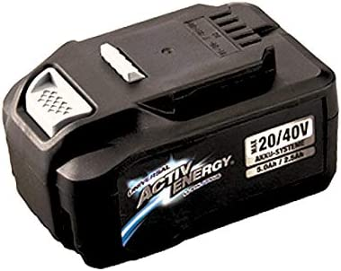

# MobiBox-JB-Sat10-v2 aka Soundklotz, Soundmops, Soundtrotz, Soundrocks

Welcome to the beautiful README of MobiBox-JB-Sat10-v2, also known as Soundklotz, Soundmops, Soundtrotz, Soundrocks. It is a affortable DIY battery powered bluetooth speaker.
This document will guide you through the various components and features of this project.
General Ideas: http://www.hifi-forum.de/viewthread-331-139.html#top

## Quick overview
- Cheap and efficient DIY PA-Loudspeaker
- Amplifier & DSP: Wondom TDA4100 DSP BT Endstufe JAB5
- Powertool battery: ACTIV Energy Li-Ion Akku 20/40V 5,0Ah / 2,5Ah 90Wh

## Amplifier & DSP

The amplifier section consists of a **Wondom TDA4100 DSP BT Endstufe JAB5**, which can be purchased from this link. This module is not only affordable but also has integrated Bluetooth and DSP functionality.

### Programming of the [ADAU1701 DSP](https://www.analog.com/media/en/technical-documentation/data-sheets/ADAU1701.pdf)

The software-project in the **DSP** folder can be used to programm the board without changes.
The DSP is programmed using the SigmaStudio software. The software can be downloaded from the [Analog Devices website](https://www.analog.com/en/design-center/processors-and-dsp/evaluation-and-development-software/ss_sigst_02.html#dsp-overview).  The program can be loaded onto the DSP using the USBi interface. The USBi interface is connected to the DSP board via the 4-pin connector. More info on this [website](https://suredsp.ratz-it.de/index.php?title=Treiber_installieren).

programm using raspberry pi and [this](https://www.richud.com/wiki/Rasberry_Pi_I2C_EEPROM_Program) guide
1.check: sudo i2cdetect -y 1   
2.read: i2cdump -y 0 0x50 i 
3.write: ./eeprog -f -8 -i hex.file -w 0x00 -t 5 /dev/i2c-1 0x50

### Audio-filters/effects
Some interesting links for audio-filters/effects:

- [Psychoakustik & Psychoakustik-Effekte](https://curdt.home.hdm-stuttgart.de/PDF/Psychoakustik_und_Psychoakustik_Effekte.pdf)
- [dynamic-bass-boost-basics]https://ez.analog.com/dsp/sigmadsp/f/q-a/65338/dynamic-bass-boost-basics)

## Battery

ACTIV Energy Li-Ion Akku 20/40V 5,0Ah / 2,5Ah 90Wh are used. Those are normaly used to power garden tools. They are cheap and have a high capacity. The files in the **Design** Folder can be used to 3D print a case for the battery. 

## PA-box reference [JB-Sat10-v2](https://www.lautsprecherforum.eu/viewtopic.php?t=4907)  
 
 

- Faital 10FE200 / Sica z009442 +Q07032B)  
- 96dB 1W/1m  
- 118dB (121dB Max / 124dB Peak) 
- 165W rms  
- 80Hz - 20,3kHz  
- 75x50°

changes:  

- 4 Ohm Faital 10FE200 to get more power out of the TPA3116
- BR-Box for higher bass efficency

### Faital 10FE200 
  
- cheap PA-chassis
- high soundpreassurelevel & efficency
- light 10" (2.2 kg) for a ferrit-magnet chassis
- 4 Ohm

things to think about:  
- Q_ts 0.54 not optimal for Bassreflex, but EPB of 105  
- needs bassboost for Fullrange use -> DSP

alternative bassdrivers: [loudspeakerdatabase](http://www.loudspeakerdatabase.com/search/type=Subwoofer,Woofer,Mid_Bass,Mid-range,Full-range/8.0_size_in_12.0/1_z_4/100_pw_500/94.0_spl_118.0/9_fs_70/0.13_qts_0.70/sort=-spl)

### Sica z009442 + Q07032B

- 1" PA tweeter horn
- 8 Ohm

## Case

### Dimensions
- 32*30*42cm outside messure  
- sandwich poplar plywood structure-> 6mm plywood, ~0.2mm PU, 6mm plywood  
	- idea: https://youtu.be/EEh01PX-q9I?t=2532 but flexibel 2k-PU is used -> cheaper than Decidamp
	- stiff
	- sounddamping
	- light (ca. 3kg wood for the hole boy)

### Bassreflex

The chassis is relieved of stress near the tuning frequency, but below that the housing no longer represents resistance and the diaphragm deflection is significantly higher
->variable bassboost - strong bass for low volume and weak bass for higher volume

## Boxsim Simulation

