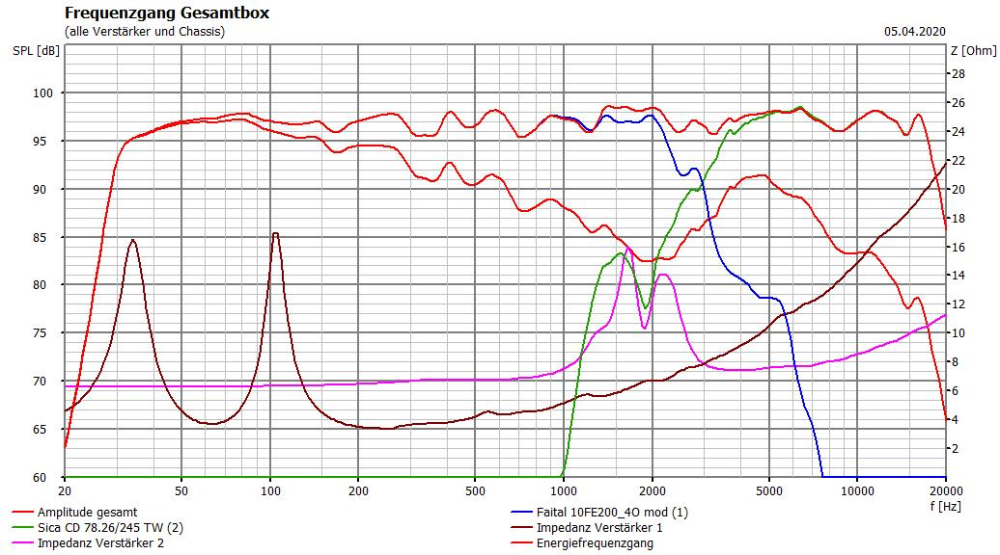
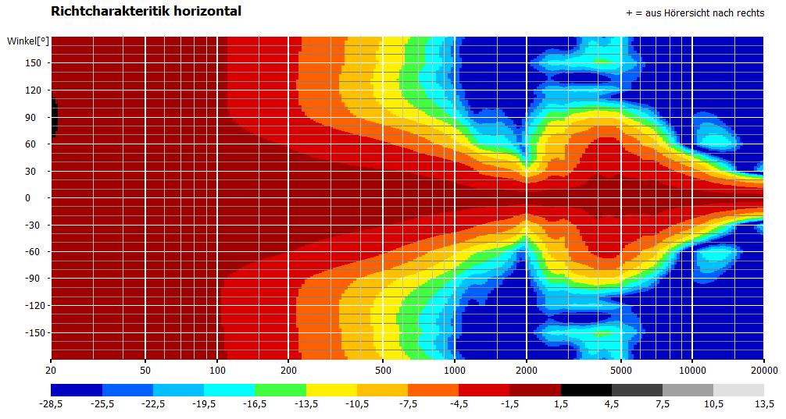

# MobiBox-JB-Sat10-v2 aka Soundklotz, Soundmops, Soundtrotz, Soundrocks

general Ideas: http://www.hifi-forum.de/viewthread-331-139.html#top

## current problems
noise due to:
- amplifier board in combination with high efficency speakers: [klick](https://www.lautsprecherforum.eu/viewtopic.php?t=6531)
- or low switching frequency of regulator for ADAU1701 board 
- **the DACs of the sure board are bad** [klick](https://stromrichter.org/showthread.php?tid=4238) 

possible solution: 
- use different DACs: [klick](https://www.google.com/search?client=firefox-b-d&q=PCM5102)
- add dc block to output [klick](https://ez.analog.com/dsp/sigmadsp/f/q-a/65144/adau1701-noise-tone-issues) "start with something higher like 7FF. That should move the idle tones up out of band."
- higher switching frequency -> test with lab power supply
- dont power the ADAU1701 and check noise

other possible solutions:
- [klick](https://www.diyaudio.com/forums/digital-line-level/294423-electronics-adau1701-module-12.html#post5033060)
## Amplifier 

**just buy [this one](https://www.boomaudio.de/wondom-tpa250-dsp-bluetooth-endstufe) next time as it has bleutooth and the dsp integrated** 

2.1 TPA3116d2 board
" Also, there's lots of 2.1 amps (chips synchronized) where you can circumvent the on board sub LP filter "

set treble frequency of 2.1 board to about 1/3 for cleanest sound according to this guy: [klick](https://www.youtube.com/watch?v=ZhzOAAmGvBg)
also highpass switch to off -> facing away from the dials
## bluetooth

maybe the [csr8645](http://www.360customs.de/2017/01/csr8645-bluetooth-4-0-apt-x-mp3-aac-faststream-breakout-board/)

## Battery

I use Lipo battery packs from ALDI as they are cheap and light weight 

 

- ca. 90wh
- high output power
- light

## DSP [ADAU1701](https://www.analog.com/media/en/technical-documentation/data-sheets/ADAU1701.pdf)

I dont use the RCA interface from sure, but solder the audio input output myself:
[

### programming:

The [Sure DSP Ratz IT Forum](https://suredsp.ratz-it.de/) provides all information for programming the DSP

https://www.360customs.de/2015/01/sigmadsp-programmieren-sigma-studio-adau17011401a-eeprom-standalone-self-boot/  
https://ez.analog.com/dsp/sigmadsp/f/q-a/65081/adau1701-not-programming
https://suredsp.ratz-it.de/index.php?title=Treiber_installieren

### audio-filters/effects:

[Psychoakustik & Psychoakustik-Effekte](https://curdt.home.hdm-stuttgart.de/PDF/Psychoakustik_und_Psychoakustik_Effekte.pdf)
https://ez.analog.com/dsp/sigmadsp/f/q-a/65338/dynamic-bass-boost-basics
https://wiki.analog.com/resources/tools-software/sigmastudio/toolbox/adialgorithms/automaticspeakereq
https://eclipseaudio.com/fir-filter-guide/

## PA-box reference [JB-Sat10-v2](https://www.lautsprecherforum.eu/viewtopic.php?t=4907)  
 
 

- Faital 10FE200 / Sica z009442 +Q07032B)  
- 96dB 1W/1m  
- 118dB (121dB Max / 124dB Peak) 
- 165W rms  
- 80Hz - 20,3kHz  
- 75x50°

changes:  

- 4 Ohm Faital 10FE200 to get more power out of the TPA3116
- BR-Box for higher bass efficency

### Faital 10FE200 
  
- cheap PA-chassis
- high soundpreassurelevel & efficency
- light 10" (2.2 kg) for ferrit-magnet chassis
- 4 Ohm

things to think about:  
- 10FE200 Q_ts 0.54 not optimal for Bassreflex, but EPB of 105  
- needs bassboost for Fullrange use -> DSP

alternative bassdrivers: [loudspeakerdatabase](http://www.loudspeakerdatabase.com/search/type=Subwoofer,Woofer,Mid_Bass,Mid-range,Full-range/8.0_size_in_12.0/1_z_4/100_pw_500/94.0_spl_118.0/9_fs_70/0.13_qts_0.70/sort=-spl)

### Sica z009442 + Q07032B

- 1" plastic tweeter horn
- 8 Ohm

## Box

idea: https://youtu.be/EEh01PX-q9I?t=2532 but flexibel 2k-PU is used -> cheaper than Decidamp

Sandwich poplar plywood-> 6mm plywood, ~1mm PU, 6mm plywood  
- stiff
- sounddamping
- light (ca. 3kg wood for the hole boy)

## Boxsim Simulation

